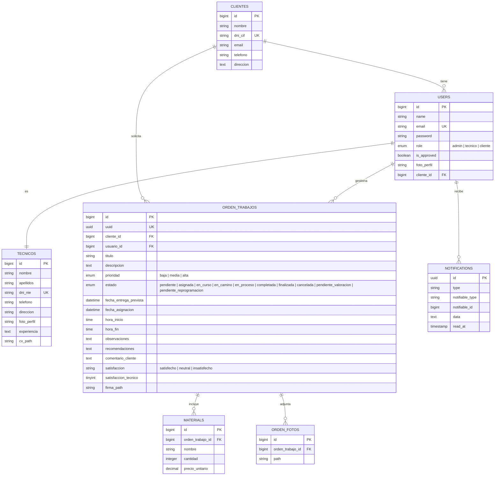

# Diagrama Entidad-Relación — WorkFlow

```mermaid
erDiagram

    CLIENTES {
        bigint id PK
        string nombre
        string dni_cif UK
        string email
        string telefono
        text direccion
    }

    USERS {
        bigint id PK
        string name
        string email UK
        string password
        enum role "admin | tecnico | cliente"
        boolean is_approved
        string foto_perfil
        bigint cliente_id FK
    }

    TECNICOS {
        bigint id PK
        string nombre
        string apellidos
        string dni_nie UK
        string telefono
        string direccion
        string foto_perfil
        text experiencia
        string cv_path
    }

    ORDEN_TRABAJOS {
        bigint id PK
        uuid uuid UK
        bigint cliente_id FK
        bigint usuario_id FK
        string titulo
        text descripcion
        enum prioridad "baja | media | alta"
        enum estado "pendiente | asignada | en_curso | en_camino | en_proceso | completada | finalizada | cancelada | pendiente_valoracion | pendiente_reprogramacion"
        datetime fecha_entrega_prevista
        datetime fecha_asignacion
        time hora_inicio
        time hora_fin
        text observaciones
        text recomendaciones
        text comentario_cliente
        string satisfaccion "satisfecho | neutral | insatisfecho"
        tinyint satisfaccion_tecnico
        string firma_path
    }

    MATERIALS {
        bigint id PK
        bigint orden_trabajo_id FK
        string nombre
        integer cantidad
        decimal precio_unitario
    }

    ORDEN_FOTOS {
        bigint id PK
        bigint orden_trabajo_id FK
        string path
    }

    NOTIFICATIONS {
        uuid id PK
        string type
        string notifiable_type
        bigint notifiable_id
        text data
        timestamp read_at
    }

    CLIENTES ||--o{ USERS : "tiene"
    CLIENTES ||--o{ ORDEN_TRABAJOS : "solicita"
    USERS ||--|| TECNICOS : "es"
    USERS ||--o{ ORDEN_TRABAJOS : "gestiona"
    ORDEN_TRABAJOS ||--o{ MATERIALS : "incluye"
    ORDEN_TRABAJOS ||--o{ ORDEN_FOTOS : "adjunta"
    USERS ||--o{ NOTIFICATIONS : "recibe"
```
